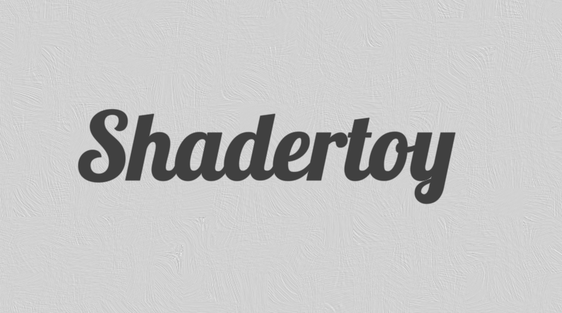

* * * * *

### Into Shadertoy and Shaders useful links and tips

Links and small descriptions to useful shader-related stuff.

**Shadertoy is a great place to create and discover amazing shader-related projects.** <https://www.shadertoy.com/>

* * * * *

[**iquilezles.org**](https://iquilezles.org/index.html)---I highly recommend all materials and articles on this website, created by [Inigo Quilez](https://twitter.com/iquilezles).
[Articles](https://iquilezles.org/www/index.htm) include very useful materials such as [2D SDF](https://iquilezles.org/www/articles/distfunctions2d/distfunctions2d.htm) and [3D SDF](https://iquilezles.org/www/articles/distfunctions/distfunctions.htm), [intersectors](https://iquilezles.org/www/articles/intersectors/intersectors.htm) functions for analytic raycasting, [smoothstep like functions](https://iquilezles.org/www/articles/functions/functions.htm), and many others worth checking.

[**shadertoyunofficial.wordpress.com**](https://shadertoyunofficial.wordpress.com/)---lots of useful tips and materials about Shadertoy and shaders, created by [Fabrice NEYRET](https://twitter.com/FabriceNEYRET).
[Usual tricks in Shadertoy](https://shadertoyunofficial.wordpress.com/2016/07/21/usual-tricks-in-shadertoyglsl/) some basics and not very obvious tips, [Special Shadertoy features](https://shadertoyunofficial.wordpress.com/2016/07/20/special-shadertoy-features/) info about Shadertoy variables and resources format.
[Shadertoy media files](https://shadertoyunofficial.wordpress.com/2019/07/23/shadertoy-media-files/) Shadertoy resources like images and others.
(*Shadertoy audio texture* [more detailed explained here](https://gist.github.com/soulthreads/2efe50da4be1fb5f7ab60ff14ca434b8))
[Avoiding compiler crash](https://shadertoyunofficial.wordpress.com/2017/11/19/avoiding-compiler-crash-or-endless-compilation/) and [Compatibility issues in Shadertoy and webGLSL](https://shadertoyunofficial.wordpress.com/2016/07/22/compatibility-issues-in-shadertoy-webglsl/).

[**thebookofshaders.com/examples**](https://thebookofshaders.com/examples/)---Examples Gallery.
[MotionToolKit](https://thebookofshaders.com/examples/?chapter=motionToolKit) useful examples to create realistic motion. [Shaping functions](https://thebookofshaders.com/examples/?chapter=05).

[**hg_sdf**](http://mercury.sexy/hg_sdf/)---3D SDF library.

[**Khronos OpenGL-Refpages**](https://www.khronos.org/registry/OpenGL-Refpages/)---list of all GLSL functions with description and limitations.

[**SPIR-V Extended Instructions for GLSL**](https://www.khronos.org/registry/spir-v/specs/unified1/GLSL.std.450.html) (Vulkan)---list of GLSL functions for Vulkan.

* * * * *

### Shadertoy alternative and similar websites:

[**vertexshaderart.com**](https://www.vertexshaderart.com/)---WebGL particles shaders.

[**neort.io**](https://neort.io/tag/bmj9c1c3p9fdr6916krg)---WebGL and also allows uploading HTML and video content.

[**glslsandbox.com**](http://glslsandbox.com/)---WebGL fragment shaders.

[**twigl.app**](https://twigl.app/) and [**thebookofshaders.com**](https://thebookofshaders.com/edit.php)---allow you to create and share links to your single WebGL shader.

**For more complex projects**---[itch.io](https://itch.io/) or [newgrounds.com](https://www.newgrounds.com/) or other similar services can be used, a service that allows uploading web projects, even github/gitlab pages that have a similar purpose. For the offline web-template look below.

* * * * *

### Offline Shadertoy related applications:

For my offline shader development---text editor with shader-viewer/render is enough, complex software has way too many bugs to deal with.

[**vulkan-shadertoy-launcher**](https://github.com/danilw/vulkan-shadertoy-launcher/releases)---very minimal application to render shadertoy shaders, using C with Vulkan API. Support Linux and Windows.

[**shadertoy-to-video-with-FBO**](https://github.com/danilw/shadertoy-to-video-with-FBO)---python script, rendering Shadertoy shaders to video frame by frame, using OpenGL. Support Linux and Windows.

**For more complex projects**---I recommend using 3D-engine with GUI Editor, I use [Godot Engine](https://godotengine.org/download). [This video](https://youtu.be/v48O7Nk_n4g) shows how to create Shadertoy logic in the Godot engine.

#### **Web export templates:**

[Minimal single shader web template](https://github.com/danilw/GLSL-howto/blob/master/minimal_webgl_glsl/mini_glsl_viewer.html) ---100 lines of code single HTML file include shaders. [Second minimal example](https://github.com/danilw/GLSL-howto/tree/master/minimal_webgl_glsl/ext_glsl_texture)---with shaders in files and textures loading.

Particle shader with transform feedback, support *vertexshaderart-like logic*---[live example](https://danilw.github.io/GLSL-howto/transorm_feedback_template/web_test_adv/feedback_advanced.html) and [source code in zip](https://github.com/danilw/GLSL-howto/tree/gh-pages/transorm_feedback_template).

*For more complex projects* I always use the Godot Web-export template.
